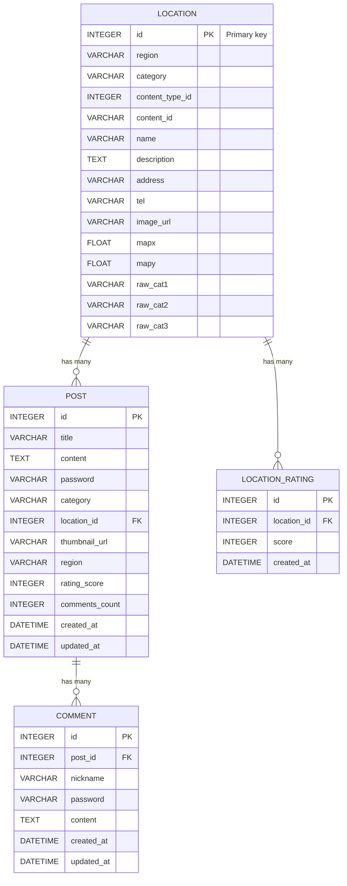

# ERD (Entity Relationship Diagram) — Glassless

아래 ERD는 서비스의 핵심 데이터 모델을 보여줍니다. Mermaid로 작성되어 Markdown에서 렌더링 가능합니다.

## 테이블 설명

- `LOCATION` — 외부 소스에서 수집한 명소/관광지 데이터. 권역(region), 카테고리(category), 좌표(mapx/mapy), 원본 id(content_id) 등 포함.
- `POST` — 사용자 커뮤니티 게시물. `location_id`가 있으면 특정 명소와 연동됨. 게시물은 `category`로 `잡담/후기/질문/구인` 등을 구분.
- `COMMENT` — 게시글에 달리는 댓글. 삭제/수정 시 비밀번호로 검증.
- `LOCATION_RATING` — 명소에 대한 사용자 별점. 클라이언트별 중복 방지는 `client_id`(응답/요청) 또는 서버 측 로직으로 처리.

## 인덱스 및 제약(권장)
- `LOCATION`: 인덱스 on `(region)`, `(category)`, `(content_id)`(unique 제약 가능)
- `POST`: 인덱스 on `(region)`, `(category)`, `(location_id)`, `created_at`(정렬)
- `COMMENT`: 인덱스 on `(post_id)`, `created_at`
- 외래키 제약: `POST.location_id -> LOCATION.id`, `COMMENT.post_id -> POST.id`, `LOCATION_RATING.location_id -> LOCATION.id`

파일: `BE/docs/erd.md`
